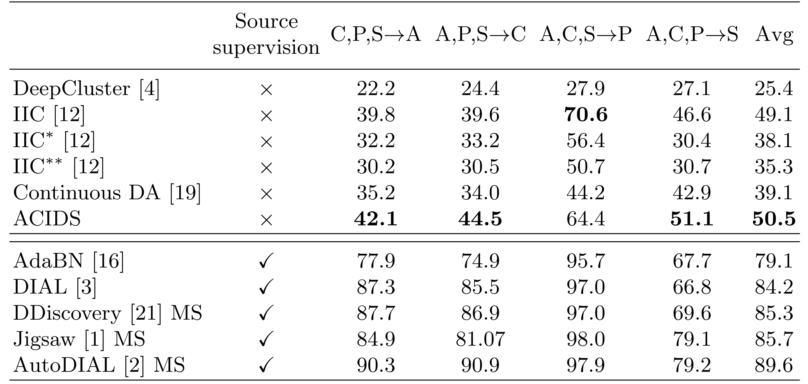
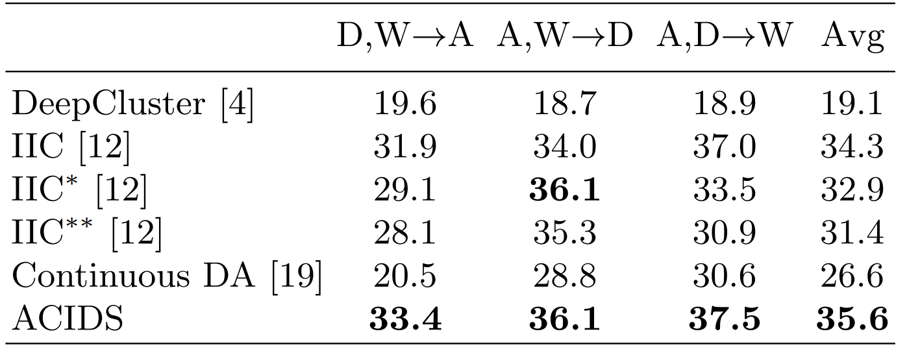
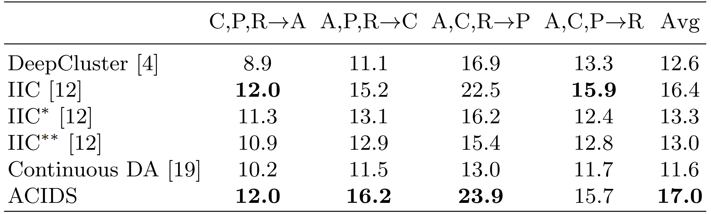
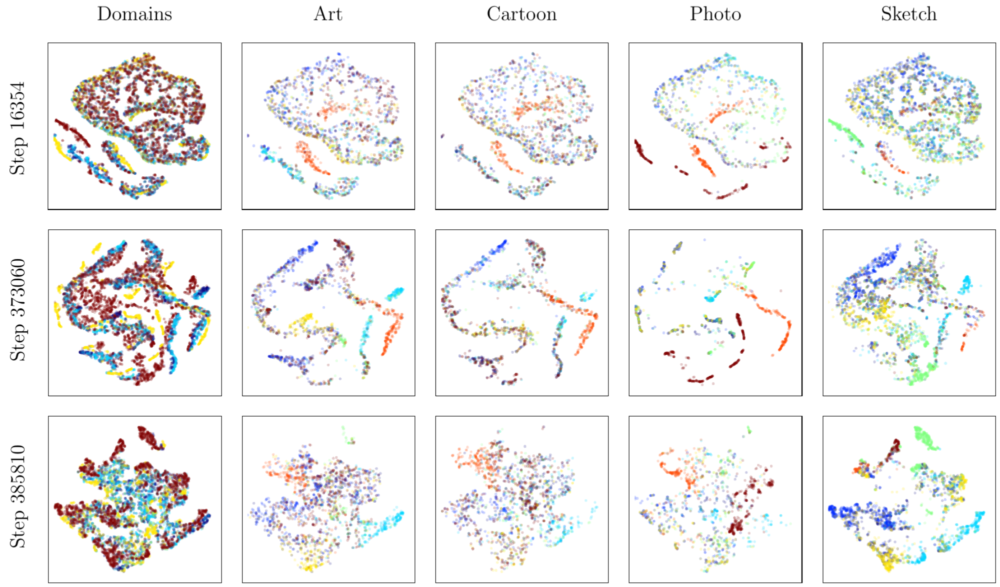

# Learning to Cluster under Domain Shift

 

      
    <em> 
    Figure 1. Illustration of the proposed Unsupervised Clustering under Domain Shift setting.
    </em>

 

> **Learning to Cluster under Domain Shift** 
> [Willi Menapace](https://github.com/willi-menapace), [Stéphane Lathuilière](https://github.com/Stephlat/), [Elisa Ricci](http://elisaricci.eu/) 
> ECCV 2020 

> Paper: [link available soon]() 

> **Abstract:** *While  unsupervised  domain  adaptation  methods  based  ondeep architectures have achieved remarkable success in many computervision tasks, they rely on a strong assumption, i.e. labeled source datamust be available. In this work we overcome this assumption and we ad-dress the problem of transferring knowledge from a source to a target do-main when both source and target data have no annotations. Inspired byrecent works on deep clustering, our approach leverages information fromdata gathered from multiple source domains to build a domain-agnosticclustering model which is then refined at inference time when target databecome available. Specifically, at training time we propose to optimize anovel information-theoretic loss which, coupled with domain-alignmentlayers, ensures that our model learns to correctly discover semantic labelswhile discarding domain-specific features. Importantly, our architecturedesign ensures that at inference time the resulting source model can beeffectively adapted to the target domain without having access to sourcedata, thanks to feature alignment and self-supervision. We evaluate theproposed approach in a variety of settings, considering several domainadaptation  benchmarks  and  we  show  that  our  method  is  able  to  au-tomatically  discover  relevant  semantic  information  even  in  presence  offew target samples and yields state-of-the-art results on multiple domainadaptation benchmarks. We make our source code public.*

## 2. Proposed Method

Our ACIDS framework operates in two phases: training on the source domains and adaptation to the target domain.

In the first phase, we employ an information-theoretic loss based on mutual information maximization to discover clusters in the source domains. In order to favor the emergence of clusters based on semantic information rather than domain style differences, we propose the use of a novel mutual information loss for domain alignment which is paired with BN-based feature alignment.

In the second phase, we perform adaptation to the target domain using a variant to the mutual information loss used in the first phase which uses high confidence points as pivots to stabilize the adaptation process.

 

      
    <em> 
    Figure 2. Illustration of the proposed ACIDS method for Unsupervised Clustering under Domain Shift setting. (Left) training on the source domains, (Right) adaptation to the target domain
    </em>

## 3. Results

### 3.1 Numerical Evaluation

      
    <em> 
    Table 1. Comparison of the proposed approach with SOTA on the PACS dataset. Accuracy (%) on target domain. Methods with source supervision are provided as upper bounds. MS denotes multi source DA methods.
    </em>

      
    <em> 
    Table 2. Comparison of the proposed approach with SOTA on the Office31 dataset. Accuracy (%) on target domain.
    </em>

      
    <em> 
    Table 3. Comparison of the proposed approach with SOTA on the Office-Home dataset. Accuracy (%) on target domain.
    </em>

### 3.1 Qualitative Evaluation

      
    <em> 
    Figure 3. Evolution of the feature space during training on PACS with Art, Cartoon and Photo as the source domains and Sketch as the target domain. The first two rows depict feature evolution during training on the source domains, the last row depicts the feature space after adaptation to the target domain. In the first column, color represents the domain, while in the others, color represents the ground truth class of each point.
    </em>

